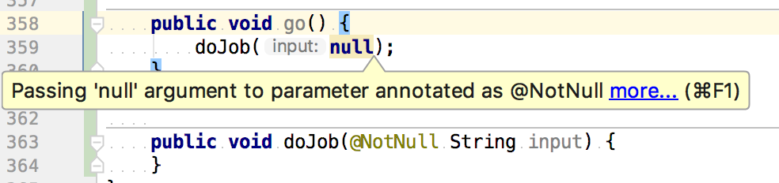

## Table of Contents

* [1. License](#1-license)
* [2. Rationale](#2-rationale)
* [3. Alternatives](#3-alternatives)
* [4. Name Choice](#4-name-choice)
* [5. Usage](#5-usage)
* [6. Build](#6-build)
* [7. Releases](#7-releases)
* [8. How to Contribute](#8-how-to-contribute)
* [9. Contributors](#9-contributors)
* [10. Evolution](#10-evolution)
* [11. Feedback](#11-feedback)
* [12. Acknowledgments](#12-acknowledgments)

## 1. License

See the [LICENSE](LICENSE.md) file for license rights and limitations (MIT).

## 2. Rationale

Null references are [considered](https://en.wikipedia.org/wiki/Null_pointer#History) to be one of the most expensive mistakes in IT design. It's not surprising that there are numerous efforts to solve it. Here are a couple of examples from the *Java* world:
* [*Kotlin*](https://kotlinlang.org/) fights them at the [language level](https://kotlinlang.org/docs/reference/null-safety.html)
* many tools try to report it as early as possible, for example, here [*IntelliJ IDEA*](https://www.jetbrains.com/idea/) warns us about a possible *NPE*: 

  

  Moreover, when the code above is compiled by the *IDE*, it automatically inserts *null*-checks:

  ```java
  public void service(@NotNull String input) {
      if (input == null) {
          throw new NullPointerException("Argument for @NotNull parameter 'input' must not be null");
      }
      // Process the input
  }
  ```
* production code often looks like below:

  ```java
  import static com.google.common.base.Preconditions.checkNotNull;

  ...

  public void service(Input input) {
    checkNotNull(input, "'input' argument must not be null");
    // Process the input
  }
  ```

*Kotlin* really solves the problem but *Java* is still a very popular language, so, we have to deal with nullable values. It's not always convenient to use *IntelliJ* build system for compiling sources to get that *null*-checks and the code which explicitly ensures preconditions via *checkNotNull()* or explicit *if (input == null) { throw new NullPointerException("<description>") }* also looks not that appealing.  

More common setup is to configure a build through [*Gradle*](https://gradle.org/)/[*Maven*](http://maven.apache.org/)/[*Ant*](https://ant.apache.org/). It would not harm to get *IDE* tips on possible *null*-related problems and that auto-generated runtime checks without explicitly putting them into code.  

Current tool solves the second problem - it allows to add *null*-checks into *\*.class* files during compilation based on source code annotations.

## 3. Alternatives

I found the only alternative which provides similar functionality - [*Project Lombok*](https://projectlombok.org/features/NonNull). Here are pros and cons for using it:
* only [*lombok.NonNull*](https://projectlombok.org/api/lombok/NonNull.html) annotation is supported - there might be problems with *IDE* highlighting possible *NPE*s in source code
* the feature is implemented through a custom [*Annotaton Processing Tool*](https://docs.oracle.com/javase/7/docs/technotes/guides/apt/index.html), which means that there are two set of *\*.class* files after the compilation - one from original code and another one with the tool-added instrumentations. Compiler plugin-based approach is more natural for such task as it's completely transparent for the further assembly construction
* a solution offered by the current project [works only for the javac8](core/javac/README.md#5-limitations), *Lombok* might operate with *javac6* and *javac7* (as *APT API* is available starting from *java6*, however, I have not verified that)

## 4. Name Choice

I really like German - how it sounds, language rules, everything, so, wanted to use a german word.  

*Traute* sounds nice and has a good [meaning](http://dictionary.reverso.net/german-english/Traute) - *Trust*. Users trust the tool and the tool enforces trust in application :wink:

## 5. Usage

The core functionality is a [*Javac* plugin](core/javac/README.md) which adds *null*-checks into the generated *\*.class* files. Even though it's possible to [use the plugin directly](core/javac/README.md#6-usage) from a command line, there are a number of adapters for popular build systems:
* [from *Gradle*](facade/gradle/README.md#3-usage)
* [from *Maven*](facade/maven/README.md#3-usage)
* [from *Ant*](facade/ant/README.md#3-sample)

## 6. Build

There is a [Travis](https://travis-ci.org/) Continuous Integration - [](https://travis-ci.org/denis-zhdanov/traute)

## 7. Releases

* [core *Javac* plugin](core/javac/RELEASE.md)
* [*Gradle* plugin](facade/gradle/RELEASE.md)

You can also subscribe for the new versions notification through [twitter](https://twitter.com/traute_java) and [facebook](https://www.facebook.com/java.traute/).

## 8. How to Contribute

* [report a problem/ask for enhancement](https://github.com/denis-zhdanov/traute/issues)
* [submit a pull request](https://github.com/denis-zhdanov/traute/pulls)
* help me to make small presents to my wife in order to persuade her that spending free time on *OSS* might be not the worst idea :yum: [](https://www.paypal.com/cgi-bin/webscr?cmd=_donations&business=3GJDPN3TH8T48&lc=RU&item_name=Traute&currency_code=USD&bn=PP%2dDonationsBF%3abtn_donateCC_LG%2egif%3aNonHosted)

## 9. Contributors

* [Denis Zhdanov](https://github.com/denis-zhdanov)

## 10. Evolution

As the project is basically a [*Javac* plugin](core/javac/README.md) and convenient build system-specific adapters to it, new features should be added to the core part. Please check the [corresponding chapter](core/javac/README.md#8-evolution).

## 11. Feedback

Please use any of the channels below to provide your feedback, it's really valuable for me:
* [email](mailto:traute.java@gmail.com)
* [twitter](https://twitter.com/traute_java)
* [facebook](https://www.facebook.com/java.traute/)

## 12. Acknowledgments


  

[JetBrains](https://www.jetbrains.com/) helps open source projects by offering free licenses to their awesome products. 

 

YourKit supports open source projects with its full-featured Java Profiler.
YourKit, LLC is the creator of <a href="https://www.yourkit.com/java/profiler/">YourKit Java Profiler</a>
and <a href="https://www.yourkit.com/.net/profiler/">YourKit .NET Profiler</a>,
innovative and intelligent tools for profiling Java and .NET applications.  

  

EJ Technologies supports open source projects by offering a [JProfiler Java profiler](https://www.ej-technologies.com/products/jprofiler/overview.html) license.